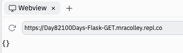

# Don't Stop 'Til You Get

Today, we're going to learn about an alternative way of getting data from forms to the webserver.

So far, we've used `post`, which (kinda) packages up all the data from the form and sends it to the server.

We can think of this as the form controlling when the data is sent.

With the `get` method, the request for the data comes **from** the webserver. It effectively says *gimme that data* to the form.

You've probably seen `get` in use before. If you've ever seen a URL with a **?** after the website name, then a bunch of **=** and maybe **&** symbols, then that website is using `get`.

## So What's The Difference?

I'm glad you asked!

With `post`, the data in the form can't be seen by your web browser. Once it's sent, it's gone. This means that you can't bookmark or share a URL based on `post` data because it will be different for each user. Ever tried to drop those SO subtle present hints by sharing a shopping cart link? Only to get a link that doesn't show any shopping cart?  Yep, that's the problem with post. The link for you will be *different* than the one for other users.


`Get` data encodes the data in the URL so we can bookmark & share it and get the same results from the page.
##
👉 Let's add some code to our Flask boilerplate to show how this works.


```python
from flask import Flask

app = Flask(__name__)


@app.route('/', methods=["GET"])
def index():
  return 'Hello from Flask'

app.run(host='0.0.0.0', port=81)
```

👉 Running this with `get` will work. Whereas, if we'd done the same thing with `post`, it will cause an error.
## Import request
👉 Again, I try to import `request`, and change the return to `return request.args`.

This will return any arguments encoded in the URL.

```python
from flask import Flask, request

app = Flask(__name__)


@app.route('/', methods=["GET"])
def index():
  return request.args

app.run(host='0.0.0.0', port=81)
  
```
Running this will get me this output (an empty dictionary) because at the moment there are *no arguments* encoded in the URL.




👉 View the page in your broswer and add a variable or two to the end of the URL like this:


Hit enter and watch what happens:


We are constructing a dictionary by passing variables in the URL.
## Personalization
If I set my flask code up so that my `request.args` is assigned to a variable `get`, then I can use some selection to do some cool personalization.

```python
from flask import Flask, request

app = Flask(__name__)


@app.route('/', methods=["GET"])
def index():
  get = request.args
  if get["name"].lower() == "david":
    return "Hello baldie"

app.run(host='0.0.0.0', port=81)
```

Look at what this does in the browser:


## Return 'no data'
👉 I also need a `return "No data"` line in case there is no data present.

The reason that `return "No data"` is not in an `else` is due to the way that `return` works.  

When a subroutine encounters a `return`, it exits the sub. So if our name is 'david', then the sub will return 'hello baldie' and then exit. Instead of carrying on to the `return "No data"`.
```python
from flask import Flask, request

app = Flask(__name__)


@app.route('/', methods=["GET"])
def index():
  get = request.args
  if get["name"].lower() == "david":
    return "Hello baldie"

  return "No data"

app.run(host='0.0.0.0', port=81)
```

## Should I Use Post Or Get?

With `post`, the data transmitted is encrypted using the webpage's default method. So if the URL starts `https`, then it's encrypted using the secure hypertext transfer protocols encryption algorithm.

This makes `post` a better choice for usernames, passwords and so on.

With `get`, the data is sent as plaintext as part of the URL, so it's **not** good for data you want to keep secure. However it is useful for settings, locations or other things that you might want to be able to bookmark.
### Try it out!